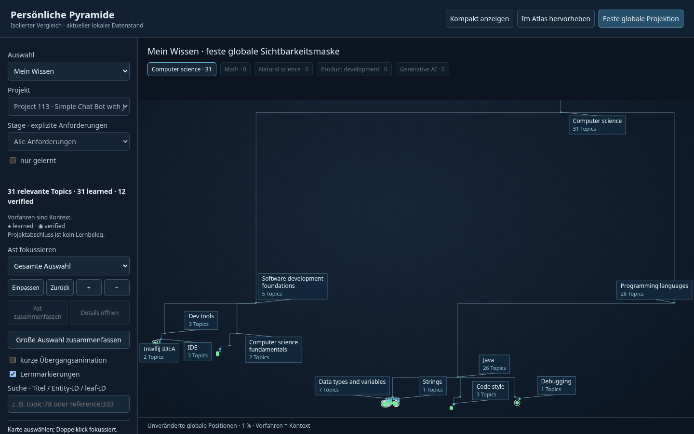
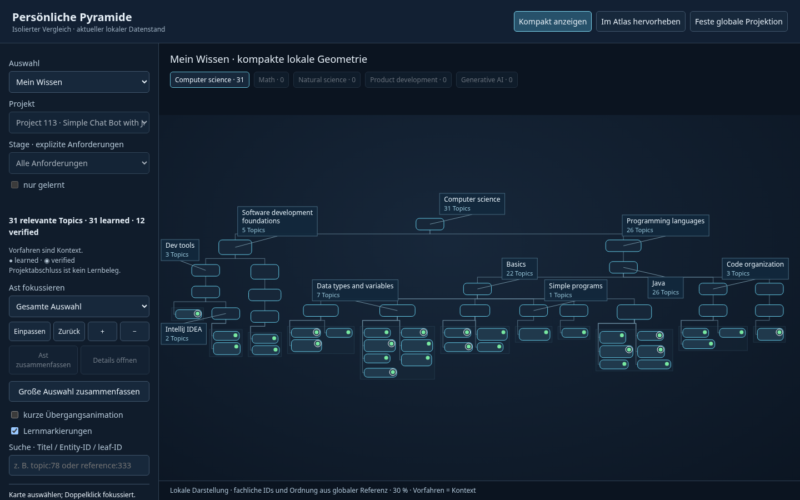

# Kompakte persönliche Pyramide — Vergleich vom 2026-10-06

**Ergebnis:** Bei 31 gelernten Topics ist die kompakte Ansicht als geordnete
Ast-/Kartenübersicht deutlich verständlicher als die globale Sichtbarkeitsmaske.
Topic-Titel brauchen weiterhin Gruppenfokus. Beim Wachstum bleibt die fachliche
Orientierung durch unveränderte IDs, Elternpfade, Reihenfolge und Breadcrumbs
nachvollziehbar; lokale Positionen bewegen sich sichtbar. Project Focus eignet
sich kompakt für Übersicht plus Gruppenlesen. „Im Atlas hervorheben“ erhält den
globalen räumlichen Kontext und die aktuelle globale Kamera.

## Verfahren und Wiederverwendung

Geordnetes, nicht nach globalen Zeilen ausgerichtetes **d3-flextree 2.1.2** mit
variablen Knotengrößen und Konturabständen; unverändertes vendortes UMD-Bundle,
WTFPL plus BSD-3-Clause für enthaltenes d3-hierarchy. [Quellen/Lizenzen](vendor/README.md).
Die vorhandenen globalen Teilbaum-Reservierungen und das ältere verschachtelte
Packing eignen sich nicht für diese sichtbare Top-down-Teilmenge.

Direkt importiert: `GlobalAtlasCore.index`, `closure`, `bounds`, `slot`, `search`,
`PyramidLabels.wrap/overlaps` und `GlobalPyramidUX.camera`. Der vorhandene Katalog
wird gelesen, nicht kopiert oder neu geführt; `build.py --check` bestätigte vorab
seine Übereinstimmung mit aktuellem Catalog/API und ACTIVE_HISTORY.

Kartentext wird mit Canvas `measureText` in den tatsächlich gerenderten
Systemschriften gemessen. Kategorien und Topics besitzen eigene variable Maße.
Direkte Topic-Kinder werden in kanonischer Reihenfolge zeilenweise in maximal drei
Spalten gruppiert. Nur diese Gruppe hat gemeinsame Zeilenhöhen. Flextree sieht
Kategorie-Karten und sichtbare Topic-Gruppen samt Abständen, keine unsichtbaren
globalen Reservierungen. Orthogonale Category-Routen und seitliche Topic-Schienen
bleiben außerhalb unbeteiligter Karten.

`m.nodes`/globale Geometrie bleiben unverändert; lokale Karten liegen in einer
separaten `Map`. Primärer Elternknoten und Root-/Geschwisterreihenfolge stammen
direkt aus A2. Mehrfachzugehörigkeiten bleiben im Inspector erreichbar; jede
Entity/leaf-ID besitzt genau eine lokale Position. Prerequisites/Projektkanten
erscheinen nur im aufklappbaren Beziehungsbereich und beeinflussen das Layout nicht.

## Sichtbarkeit und aktuelle Daten

| Auswahl | Explizite Topics | Mit Hierarchiekontext dargestellte Entities | learned / verified |
|---|---:|---:|---:|
| Mein Wissen | 31 | 52 | 31 / 12 |
| Akzeptierte Landschaft / ACTIVE_HISTORY | 89 | 135 | 31 / 12 |
| Course 8 | 89 | 135 | 31 / 12 |
| Course 8, nur gelernt | 31 | 52 | 31 / 12 |
| Project 113 | 26 | 47 | 26 / 10 |
| Stage 617, explizite Stage-Anforderungen | 12 | 28 | 12 / 7 |

Mein Wissen beginnt ausschließlich bei explizitem `is_learned === true`.
ACTIVE_HISTORY enthält 46 Kategorien und 89 Topics; akzeptiert bedeutet nicht
gelernt. Course verwendet explizite Mitgliedschaften, Project explizite
Anforderungen. „nur gelernt“ bildet zuerst die Schnittmenge der Topic-Seeds,
danach deren Kontext. Bei Project 113 und Stage 617 ändert die Schnittmenge hier
nichts: die tatsächlichen persönlichen Einzelbelege decken alle Anforderungen ab.
Projektabschluss liefert keinen zusätzlichen learned-/verified-/applied-Beleg.

Alle strukturellen Vorfahren bleiben Kontext, weitere Eltern bleiben zugänglich.
Category-Zusammenfassungen zählen eindeutige relevante IDs mit learned/verified
getrennt. **Project 380 zeigt Requirements UNKNOWN**, Stage 618 dagegen eine
belegte leere Anforderungsmenge. Stage 617 verwendet seine 12 expliziten, nicht
eine abgeleitete kumulative Menge. Referenz-Aliase finden denselben leaf-Slot,
ohne eine Topic-Identität zu erfinden.

## Browservergleich: ausschließlich 1440 × 900

Globale Maske und lokale Übersicht derselben 31 Topics:




Die Ausdehnung sinkt von **76.814 × 43.416** auf **3.657 × 956** Layout-Einheiten;
die Fit-Skalierung steigt von 1,40 % auf 29,92 %. Beide Übersichten verwenden
lesbare, kollisionsfreie Astbeschriftungen. Kompakt bleiben die einzelnen Karten
und fachlichen Gruppen erkennbar; global erscheinen die Topic-Karten als Punkte.

| Vergleich | Bilder |
|---|---|
| Persönliches Gruppenlesen | [Topic-Gruppe](tests/my-topic-group.png) |
| ACTIVE_HISTORY / Course | [akzeptiert](tests/accepted.png), [Course 8](tests/course-8.png), [nur gelernt](tests/course-8-learned.png) |
| Project / Stage | [Project-Übersicht](tests/project-113.png), [lesbare Gruppe](tests/project-topic-group.png), [Stage 617](tests/stage-617.png) |
| Globale Orientierung | [Project im bestehenden Atlas](tests/atlas-project-highlight.png), [Topic 78](tests/atlas-topic-78.png), [Referenz 333](tests/atlas-reference-333.png) |
| Unbekannte Anforderungen | [Project 380](tests/project-unknown.png) |
| 300 Slots | [offen](tests/load-300-expanded.png), [zusammengefasst](tests/load-300-summarized.png) |
| 1.000 Slots | [offen](tests/load-1000-expanded.png), [zusammengefasst](tests/load-1000-summarized.png) |
| Vollständige Struktur | [offen](tests/full-expanded.png), [fünf Root-Zusammenfassungen](tests/full-summarized.png), [Detail per Suche geöffnet](tests/full-opened.png) |
| Lernschritte | [ein Ast: Beginn](tests/growth-branch-0.png), [Ende](tests/growth-branch-3.png), [mehrere Äste: Beginn](tests/growth-wide-0.png), [Ende](tests/growth-wide-3.png) |

26 Screenshots wurden aufgenommen; die wesentlichen Vergleichs-, Filter-,
Wachstums- und Lastansichten wurden visuell geprüft. Kein konkretes
Containerproblem und kein Seitenüberlauf; kein zweiter Viewport nötig.

## Messwerte und Wachstum

Einzelmessungen lokaler Chromium-Läufe, einschließlich Textmessung, Packing und
Layout; keine behaupteten Produktionsbenchmarks. Labels sind Kartenbeschriftungen
oder bei kleiner Skalierung lesbare Ast-Callouts, keine Tausenden Mini-Labels.

| Szene | Layout ms | gerenderte Karten / Labels bei Fit | lokale Ausdehnung |
|---|---:|---:|---:|
| Mein Wissen | 3,8 | 52 / 10 | 3.657 × 956 |
| ACTIVE_HISTORY / Course 8 | 1,9 / 1,5 | 135 / 9 | 10.049 × 1.234 |
| Project 113 | 0,7 | 47 / 10 | 3.433 × 906 |
| Stage 617 | 0,6 | 28 / 11 | 1.822 × 838 |
| Fixture 300, offen → zusammengefasst | 3,5 → 0,5 | 382 / 5 → 3 / 3 | 25.660 × 920 → 422 × 200 |
| Fixture 1.000, offen → zusammengefasst | 10,8 → 0,6 | 1.285 / 9 → 6 / 6 | 90.114,5 × 1.050 → 1.127 × 200 |
| Vollständige Struktur, offen → zusammengefasst | 31,0 → 1,3 | 3.955 / 12 → 5 / 5 | 267.700 × 1.180 → 1.145 × 70 |

Fixtures selektieren bekannte Struktur-Slots, zeigen ausschließlich generische
Fixture-Titel und behaupten keinen echten Topic-Fortschritt. Last-Seeds folgen
kanonischer Traversierung; die 300-/1.000-Fixtures sind dadurch astlastig.
Die separate Mehrast-Fixture verteilt sich über mehrere Roots.

Bewegung bestehender lokaler Karten, einmal pro gemeinsamer Entity verglichen,
in lokalen Layout-Pixeln vor Kameraausgleich:

| Fixture-Schritt | bestehend / bewegt | Median / Maximum |
|---|---:|---:|
| Ein Ast: 1 → 3 Slots | 6 / 6 | 63 / 63 px |
| Ein Ast: 3 → 6 | 8 / 0 | 0 / 0 px |
| Ein Ast: 6 → 12 | 11 / 9 | 92 / 374,23 px |
| Mehrere Äste: 4 → 8 | 19 / 2 | 0 / 357 px |
| Mehrere Äste: 8 → 16 | 34 / 29 | 87 / 92 px |
| Mehrere Äste: 16 → 26 | 46 / 33 | 256 / 612,29 px |

Der links-obere Bildschirmanker der ausgewählten Karte blieb in allen sechs
Schritten bei **0 px** gemessener Abweichung. Das ist ein Kameraausgleich für diese
Szenen, keine allgemeine Garantie unveränderlicher lokaler Geometrie. Fokus auf
Category 35 und Topic 15 dauerte jeweils **0,4 ms**, ohne Layout. Gruppenfokus
zeigte 13 lesbare Kartenbeschriftungen bei 125 %; Breadcrumbs erhalten den Pfad.

## Bedienung, Grenzen und gezielte Checks

Auswahl-/Stage-/Astfilter und „nur gelernt“ wirken erst nach expliziter Aktion.
Tippen, Hover, Highlight, Styling, Pan/Zoom und Fokus auf bereits dargestellte
Karten lösen kein Layout aus. Zusammenfassen/Öffnen und Lernschritte ändern die
sichtbare Struktur und dürfen neu anordnen. Versteckte Details bleiben über Suche
erreichbar. Der bestätigte Category-35-Filter enthält tatsächlich sieben gelernte
Topics. Optionaler 180-ms-Fade nutzt durchgehend geprüfte Endkoordinaten;
Reduced Motion schaltet ihn aus.

„Im Atlas hervorheben“ benutzt die vorhandene Referenz als iframe plus unabhängige
globale ID-/Pfad-Markierungen. „In globaler Pyramide zeigen“ übergibt die ID an
ihre bestehende Fokusfunktion. Die globale Minimap gehört ausschließlich zur
globalen Kamera; die lokale Ansicht zeigt Entity-/Root-Kontext ohne globales
Viewport-Rechteck.

Die vollständig offene Ansicht wird mit Hunderten Slots sehr breit. Sie ist eine
Strukturübersicht; lesbares Arbeiten benötigt explizite Zusammenfassungen, Astfokus
oder Suche. Schon 31 Topics zeigen nicht alle Titel gleichzeitig. Callouts können
nachrangige Astnamen unterdrücken. Lokale Veränderungen sind bei Spaltenwechseln
und Mehrast-Wachstum erheblich. Es gibt keine DOI-Engine, keine inkrementelle
Optimierung, keine persistierte lokale Ansicht und keine getestete mobile Variante.

**PASS:** 13 fokussierte Core-Szenen plus acht Wachstumszustände; sieben zusätzlich
mit echten Browser-Schriftmaßen geprüfte Layouts; richtige IDs, keine doppelten
Slots, Reihenfolgen, UNKNOWN/leer, Schnittmengen, Collapse/Suche, Alias-/Mehrfach-
zugehörigkeit, wiederholbare Koordinaten/Routen, keine Karten- oder Routenkollision.
Räumliche Buckets reduzieren den vollständigen Browser-Check auf 8.251 mögliche
Kartenpaare und 45.102 Segment/Karten-Kandidaten. Kein redundanter Paarvergleich
globaler Koordinaten: jeweils ein Vergleich je 3.955 Entities pro Testumgebung.
Keine Layout-Aufrufe durch Highlight/Styling, keine Browserfehler, externe Requests
oder Storage-Schreibzugriffe. [Core](tests/core-results.json),
[Browser](tests/browser-results.json), [Navigation/Motion](tests/navigation-results.json).

**Globale Verschiebung 0 px; 1.527 ursprüngliche getrackte/ungetrackte Dateien
bytegleich**, ursprünglicher Git-Status erhalten, keine neuen geschützten Dateien.
Elf von Git ignorierte historische Review-/Browser-Logs liegen ebenfalls vor
Auftragsbeginn; sie sind nicht im ursprünglichen Hashinventar, ihre Änderungszeiten
wurden separat geprüft. [Integritätsnachweis](tests/integrity-results.json).
Globale SHA256 unverändert:
`bf79e7309129421b32899900a47f1c9f47d624f2fa16a4eb8b503f1be52aab25`.
Alle neuen Artefakte liegen unter `prototypes/adaptive-pyramid/`.

## Lokal starten

Exakt verwendeter Befehl im Arbeitsverzeichnis `/home/anton/IdeaProjects/hyperskill-projects`:

```sh
python -B -m http.server 8765 --bind 127.0.0.1 --directory .
```

**URL:** http://127.0.0.1:8765/prototypes/adaptive-pyramid/

Keine Migration, neue Hyperskill-Erfassung, Review-Pakete, Commits, Pushes oder
Deployments durchgeführt. Der Prototyp und diese Vergleichsentscheidung sind
der Abschluss dieses Auftrags.
