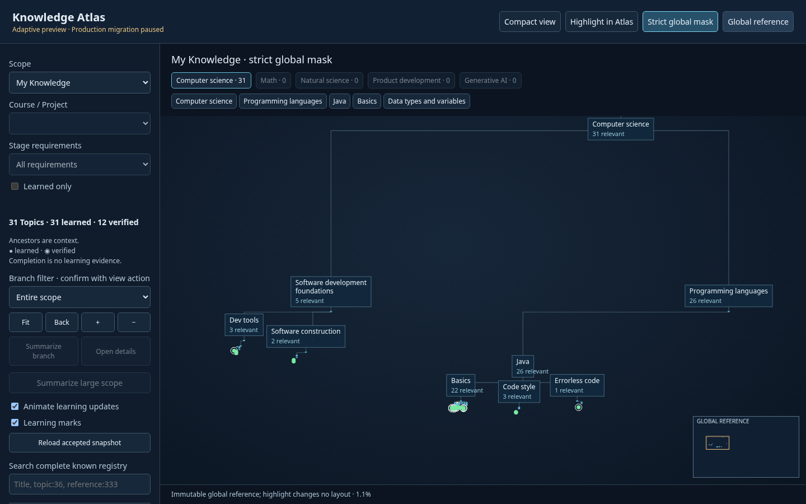
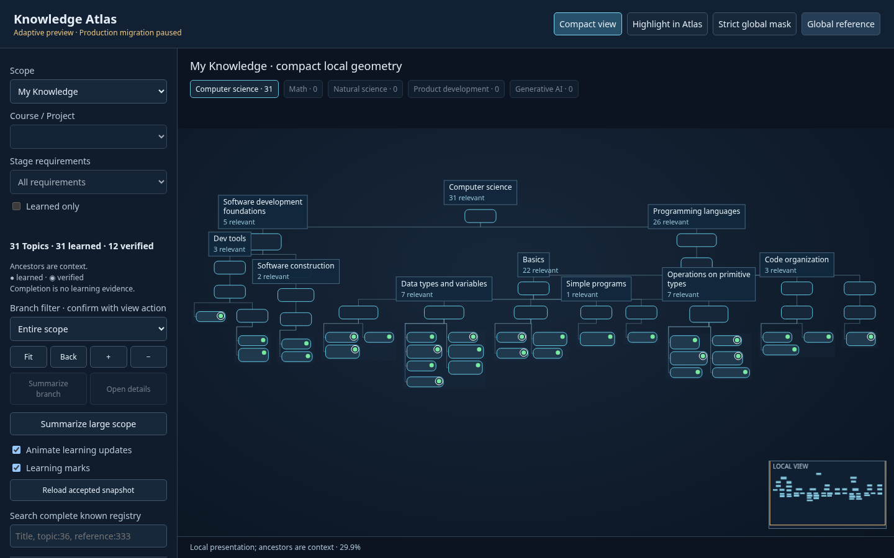
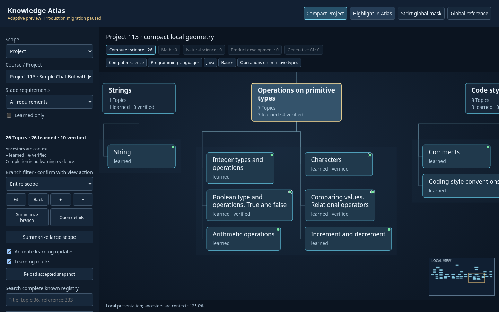
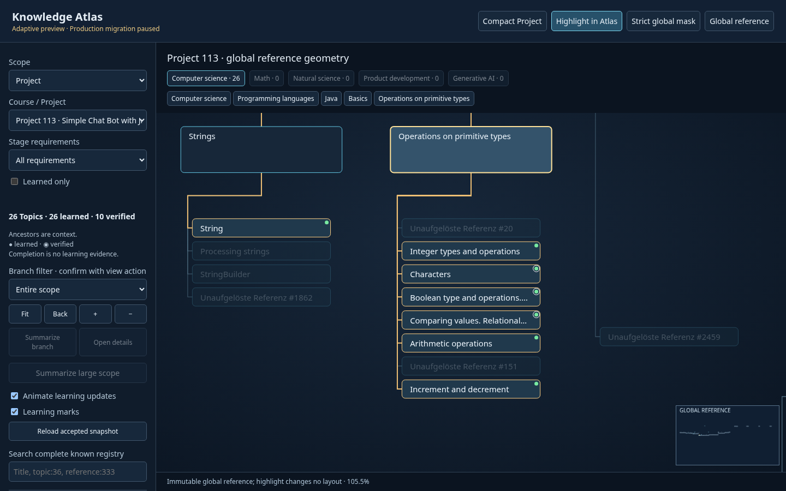

# Adaptive Atlas integration — 2026-10-06

**C — READY FOR A PRODUCTION ADAPTIVE-VIEW MIGRATION PREVIEW**

The normal Atlas updater now generates an isolated dual-view candidate. My Knowledge
defaults to learned-only semantic content with hierarchy context. The compact map is
substantially clearer as a branch/card overview: its area is 954 times smaller than
the same global visibility mask. Topic reading still requires group focus. Project
and Stage focus gain readable local groups; highlighting retains the complete global
reference and its camera. This recommendation authorizes no Production change.

Production migration is **PAUSED_PENDING_ADAPTIVE_VIEW_ACCEPTANCE**. All previously
prepared strict-global Version-A migration packages are **NOT CURRENTLY APPROVED FOR
EXECUTION** and non-applicable. The updater and real spatial authorization entry
point reject strict-global execution before historical operators can run. Historical
reports, reviews, tokens, receipts, prototypes and canonical geometry remain intact.

## Architecture and geometry storage

```text
existing Knowledge loader / validation / Catalog projection + ACTIVE_HISTORY
                      ↓
             one semantic registry
              ↙                 ↘
immutable global reference     pure scope + measured adaptive layout
reference / mask / highlight   My Knowledge / compact Course / compact Project
global camera + minimap        local camera + minimap
```

`--adaptive-preview` enters the normal updater through a separate, narrowly scoped
build path. It reuses `snapshot.load_source`, `active_projection`, normal validation
and `catalog_projection.project`. It does not enter the legacy State slot allocator
or Production transaction. The current Production runtime remains legacy V6; this
integration does not assume that any previous migration was executed.

`AtlasRegistry` freezes the Catalog read model and reference records. Taxonomy
adapters inherit the same semantic records and contain no coordinates. A separate
reference Map resolves `topic:36` to the immutable `leaf:36` position. Search aliases
`reference:36`, `topic:36` and `leaf:36` resolve to that same semantic Topic when it
exists; unresolved references keep their own semantic identity and leaf mapping.
Local cards live in another Map. No global node or Catalog entity receives local x/y.

The immutable reference is packaged byte-for-byte from the validated A2 artifact;
no global layout is generated. Structure/membership mismatches fail the preview
build and require separate reference review. Root order, primary parent and sibling
order guide every local layout. Secondary memberships, prerequisites, project
relations and evidence remain inspectable; they do not reorder the taxonomy.

Local geometry, collapse state, two independent cameras, navigation history and
previous animation positions exist only in browser memory. There is no persisted
personal checkpoint, localStorage write, second Catalog or synthetic Knowledge file.
This is the smallest sufficient persistence model for deterministic initial layout.

## Files changed and reuse

Only four existing files changed relative to the captured working state:

- `scripts/update-knowledge-atlas.py`: preview dispatch and current migration guard.
- `scripts/knowledge_atlas/spatial_authorization.py`: direct real strict-migration guard.
- `scripts/knowledge_atlas/README.md` and `prototypes/global-pyramid/README.md`: current-decision notices, retaining historical content.

New normal-stack sources are `architecture.py`, `ARCHITECTURE-DECISION.md`,
`adaptive_preview.py`, `presentation/{adaptive,registry,views}.cjs` and
`adaptive_runtime/{index.html,app.js,style.css}`. The generated preview contains 15
managed assets under `docs/knowledge-map-adaptive-preview/`. Focused tests, 40 browser
images and results are under `integration-tests/` beside this report.
[Complete file inventory](integration-tests/files-changed.json).

The validated adaptive core was promoted without changing its layout algorithm;
real-scope output parity with the original prototype passes. Existing normal
`canonical_runtime/atlas.js`, `labels.js` and `ux.js` supply closure, IDs, search,
bounds, wrapping, overlap helpers and camera calculation. The canvas renderer and
focus controls reuse the working prototype approach within one normal read-model
runtime; the integration no longer loads a second Atlas through an iframe.

Layout remains **d3-flextree 2.1.2**, ordered variable-size contour layout, with the
unchanged vendored bundle and its WTFPL / bundled d3-hierarchy BSD-3-Clause licenses.
[Dependency record](vendor/README.md). Canvas measures actual card text. Direct
Topics use canonical row-major groups of up to three columns, with row heights
local to each group. Hidden descendants reserve no full card space. No new optimizer
or global depth-wide row height was introduced.

## Visibility and Course / Project behavior

Counts are from the current normalized Knowledge and accepted history, not constants
used to select entities. The registry has 849 Categories, 89 described Topics and
3,017 unresolved references: 3,955 semantic entities / reference positions.

| Scope | Explicit Topics | Entities including context | Learned / verified Topics |
|---|---:|---:|---:|
| My Knowledge, default | 31 | 52 | 31 / 12 |
| Accepted Landscape | 89 | 135 | 31 / 12 |
| Course 8 | 89 | 135 | 31 / 12 |
| Course 8, learned only | 31 | 52 | 31 / 12 |
| Project 113 | 26 | 47 | 26 / 10 |
| Stage 617 of Project 113 | 12 | 28 | 12 / 7 |

My Knowledge seeds only `is_learned === true`; verified is independent styling.
Ancestors are context and gain no learned status or membership. Accepted Landscape
uses the existing ACTIVE_HISTORY (46 Categories / 89 Topics), explicitly labelled
as broader accepted content. Course seeds come from explicit Catalog membership;
Project seeds come from explicit requirements. Learned-only intersects Topic seeds
before rebuilding context. All current Project 113 and Stage 617 requirements happen
to have individual learned evidence, so that intersection changes neither scope.
Stage 617 uses its own explicit requirements rather than inferred cumulative stages.

Project 380 renders **Requirements UNKNOWN**, distinct from the evidenced empty
Stage 618. An absent Stage also remains UNKNOWN. Completion, requirements and
membership never manufacture learned, verified or applied facts. Normal progress
and evidence loading are shared with the existing Catalog projection.

Selection, Stage, learned-only and branch controls become effective on a confirmed
view action. Typing and hover cause no layout. **Highlight in Atlas** paints matching
IDs and paths on all 3,955 global positions and preserves the global camera exactly.
**Compact Course / Project** derives separate local coordinates. **Strict global
mask** is retained as a comparison action. **Show in Global Atlas** focuses the
selected ID at its unchanged reference position. Search covers the whole registry;
dormant selection does not learn anything. My Knowledge destination is enabled only
when the ID is currently visible there. Evidenced Course / Project context is offered
through the same Catalog memberships and requirements.

Local minimaps use local bounds and local cameras. Global reference/mask minimaps
use global bounds and global cameras. Compact global orientation uses root counts,
identity highlights and breadcrumbs; no local viewport is projected onto global x/y.

## Strict global versus adaptive measurements

One Chromium viewport: **1440 × 900**, device scale 1, system fonts. Width/height
are bounds of the same visible cards, in layout pixels; area is their bounding-box
area. Fit scale uses identical view padding. Single-run times include text/card
measurement and layout; they are not Production benchmarks. Course/accepted scope
can reuse the same cached layout. Reference and highlight perform zero layout calls.
Exact values and per-scene card/label counts: [browser results](integration-tests/browser-results.json).

| Scope | Global mask W × H | Mask area, million px² | Adaptive W × H | Adaptive area, million px² | Fit mask → adaptive | Adaptive ms |
|---|---:|---:|---:|---:|---:|---:|
| My Knowledge | 76,814 × 43,416 | 3,334.957 | 3,657 × 956 | 3.496 | 1.147% → 29.915% | 3.7 |
| Accepted Landscape | 167,748 × 44,183 | 7,411.610 | 10,049 × 1,234 | 12.400 | 0.652% → 10.887% | 2.0 |
| Course 8 | 167,748 × 44,183 | 7,411.610 | 10,049 × 1,234 | 12.400 | 0.652% → 10.887% | cached 2.0 |
| Project 113 | 76,814 × 43,416 | 3,334.957 | 3,433 × 906 | 3.110 | 1.147% → 31.867% | 0.7 |
| Stage 617 | 76,814 × 42,818 | 3,289.022 | 1,822 × 838 | 1.527 | 1.163% → 59.427% | 0.5 |

All five scopes have **zero card overlaps and zero hierarchy routes crossing
unrelated cards**, both compact and strict mask. At overview fit, neither projection
displays complete readable Topic titles; compactness improves branch/card structure,
not simultaneous reading of all Topics. Topic readability counts require a full,
untruncated real Topic title, scale ≥80%, and the entire card on screen.

The same largest direct-Topic-group Category is focused in both projections:

| Scope | Full Topic titles, mask → compact | Cards / labels at compact overview fit |
|---|---:|---:|
| My Knowledge | 10 → 10 | 52 / 10 |
| Accepted Landscape | 13 → 12 | 135 / 11 |
| Course 8 | 13 → 12 | 135 / 11 |
| Project 113 | 5 → 8 | 47 / 11 |
| Stage 617 | 2 → 6 | 28 / 16 |

The global group can equal or exceed the compact group for personal/Course title
count. Compact's measured advantage is much smaller overall extent, denser semantic
context and Project/Stage group reading. It is not universally more readable in
every already-focused global group. Highlight screenshots show complete neighboring
reference context at precisely the preceding global group camera, without relayout.






| Other required scene | Overview / detail / reference evidence |
|---|---|
| Global reference | [complete registry](integration-tests/global-complete.png), [dormant reference destination](integration-tests/global-reference333.png) |
| My Knowledge | [compact group](integration-tests/my-compact-group.png), [same global group](integration-tests/my-strict-group.png), [Topic 36 destination](integration-tests/my-topic36.png) |
| Accepted Landscape | [compact](integration-tests/accepted-compact.png), [strict](integration-tests/accepted-strict.png), [group](integration-tests/accepted-compact-group.png) |
| Course 8 | [compact](integration-tests/course8-compact.png), [strict](integration-tests/course8-strict.png), [highlight](integration-tests/course8-highlight.png), [learned only](integration-tests/course8-learned.png) |
| Project 113 | [compact overview](integration-tests/project113-compact.png), [strict](integration-tests/project113-strict.png), [same global group](integration-tests/project113-strict-group.png) |
| Stage 617 | [compact](integration-tests/stage617-compact.png), [strict](integration-tests/stage617-strict.png), [compact group](integration-tests/stage617-compact-group.png), [highlight](integration-tests/stage617-highlight.png) |
| Unknown requirements | [Project 380](integration-tests/unknown.png) |

## Learning flow, movement and animation

An accepted normalized snapshot updates semantic state; pure scope selection then
changes My Knowledge. The controller recomputes only the derived compact Map and
adjusts its local camera to retain a selected card anchor when that card survives.
Already-known Topics require no global allocation. Reloading an unchanged snapshot,
changing verified styling, highlight, hover, typing, pan/zoom and ordinary focus
make no layout call. Signature caching depends on visible/explicit IDs, fixture and
collapse state; live learned/verified counts and styling are refreshed independently.

The isolated in-memory learning scenario sets already-known Topic 1 learned:
31 → 32 learned, verified stays 12. No actual Knowledge fact is written. Across 52
existing local cards, browser-measured displacement is **37.303 px average / 228 px
maximum** before camera compensation (11 cards move; median 0). Bounds change from
3,657 × 956 to 3,885 × 956. The selected card's screen anchor moves **0 px** in this
scene; all 3,955 global reference positions move **0 px**. One local layout call.
[Learning image](integration-tests/learning-addition.png), [per-entity Core movement](integration-tests/core-results.json).

Existing cards interpolate previous-to-target x/y and sizes for **180 ms** with a
deterministic eased target and interpolated camera. New cards appear when existing
cards settle; hierarchy routes are shown at the settled layout. This prevents the
demonstrated new-card/old-card collision during this learning transition. Samples at
0/45/90/135/180 ms have no rendered-card collision. Reduced motion skips animation;
the UI also offers an animation switch. There is no absolute local 0-px promise.
The original wider-growth observation of up to 612 px remains valid historical
evidence; the integration does not replace it with this smaller single-addition result.

## Large sets and summaries

Fixtures select known structural leaf slots with generic fixture Topic/slot titles
and no progress assertion. The broad fixture uses 20 slots per root, 100 total.
They remain presentation-only and are never written to Catalog, Knowledge or State.

| Fixture | Cards expanded → summary | Expanded W × H | Summary W × H | Layout ms expanded → summary | Fit expanded → summary | Labels expanded → summary |
|---|---:|---:|---:|---:|---:|---:|
| 100 slots | 125 → 2 | 8,168 × 920 | 202 × 200 | 1.4 → 0.3 | 13.394% → 125% | 6 → 2 |
| 300 slots | 382 → 3 | 25,660 × 920 | 422 × 200 | 3.2 → 0.4 | 4.263% → 125% | 5 → 3 |
| 1,000 slots | 1,285 → 6 | 90,114.5 × 1,050 | 1,127 × 200 | 11.2 → 0.8 | 1.214% → 97.072% | 6 → 6 |
| Broad five-root scope | 137 → 15 | 9,231 × 722 | 2,330.5 × 200 | 1.4 → 0.4 | 11.851% → 46.943% | 8 → 10 |

Expanded areas are respectively 7.515 / 23.607 / 94.620 / 6.665 million px²;
summary areas 0.0404 / 0.0844 / 0.2254 / 0.4661 million px². Both expanded and
search-opened states pass collisions/routes. Summaries show unique relevant counts
with learned and verified separated, and clearly say Summary. Fixture counts mean
structural slots, not personal learning percentage. Hidden details are found and
opened by search in every fixture. Broad scope still needs branch focus to read every
summary; a single fit cannot make all branch names equally prominent. No DOI engine.

[100 expanded](integration-tests/load-100.png) / [summary](integration-tests/load-100-summary.png),
[300 expanded](integration-tests/load-300.png) / [summary](integration-tests/load-300-summary.png),
[1,000 expanded](integration-tests/load-1000.png) / [summary](integration-tests/load-1000-summary.png),
[broad expanded](integration-tests/broad.png) / [summary](integration-tests/broad-summary.png).

## Focused verification and protected hashes

**PASS** focused Core scenarios (12), browser layout/route checks (13), deterministic
repeated explicit layout inputs, original algorithm parity, independent scope ID
checks, one position per semantic slot, primary hierarchy/order, context semantics,
UNKNOWN versus known-empty, confirmed filters, full-registry search, separate
geometry/cameras/minimaps, highlight/style no layout, snapshot learning flow,
animation/anchor/reduced motion and deterministic repeated preview builds.
[Core](integration-tests/core-results.json), [browser](integration-tests/browser-results.json),
[integrity](integration-tests/integrity-results.json).

Bucket-based browser checks examine 5,833 candidate card pairs and 31,872 segment/card
candidates, rather than an all-pairs matrix. Reference invariance compares each of
3,955 entities once per test environment. Browser errors, external requests and
storage writes: **0**. No page/container overflow at 1440 × 900. No second viewport,
repository-wide regression, crash matrix, migration tests or historical review
execution was needed. Representative comparison/summary and key navigation images
were visually inspected at that viewport.

Protected file inventories and bytes are identical to the task-start working state:
14 Production files, 4 State files, 11 Knowledge files. Aggregate SHA256 is calculated
over canonical sorted compact JSON mapping repository-relative paths to file SHA256;
the linked integrity artifact contains every individual hash.

| Protected area | Unchanged aggregate SHA256 |
|---|---|
| `docs/knowledge-map/` | `0b1b1f413c13f36689119c7b7115ae4bd963ff67352edfabcc72600ae037ee00` |
| `state/knowledge-atlas/` | `7b69371cb87d3dcb880803b9698b90bf09f322152ae8f1867424557a14b22137` |
| `data/knowledge/` | `29a3d477c5aed81e53c2bf551abcb6f41fbbf3b42d71e56a0bc7c813489d35f9` |
| Global reference bytes | `bf79e7309129421b32899900a47f1c9f47d624f2fa16a4eb8b503f1be52aab25` |

Of 869 captured pre-existing files, 865 are byte-identical and only the four declared
updater/decision-notice files changed. No original file was removed. Pre-existing
untracked prototypes/review files and unrelated tracked edits remain preserved.

## Remaining limits and local start

Compact maps still grow horizontally and overview fit suppresses Topic titles.
Group/branch focus and explicit summary are necessary; summaries are not an automatic
DOI policy. Animation was checked for one learned addition, not arbitrary bulk edits.
Navigation state is intentionally lost on reload. This preview reads/regenerates
accepted normalized Knowledge; it adds no learning writer or remote acquisition.
Canonical reference structure changes need separate review, rather than silent global
slot allocation. Accessibility uses search, controls and keyboard navigation; canvas
cards are not a complete semantic screen-reader tree. Mobile and Production packaging
remain outside this candidate's validation scope.

The candidate is suitable for the next adaptive-view migration preview because the
semantic/read-model integration, measured compact behavior and reference isolation
pass the requested scope. Further acceptance remains necessary before any Production
replacement. No Production migration, new Hyperskill capture, new migration review
package, commit, push or deployment was performed.

Exact commands from `/home/anton/IdeaProjects/hyperskill-projects`:

```sh
python -B scripts/update-knowledge-atlas.py --adaptive-preview --json
python -B scripts/update-knowledge-atlas.py --adaptive-preview --check --json
python -B -m http.server 8765 --bind 127.0.0.1 --directory .
```

URL: **http://127.0.0.1:8765/docs/knowledge-map-adaptive-preview/**

Focused reproducible checks:

```sh
node prototypes/adaptive-pyramid/integration-tests/core.cjs
python -B prototypes/adaptive-pyramid/integration-tests/build.py
PLAYWRIGHT_MODULE=/home/anton/.cache/codex-runtimes/codex-primary-runtime/dependencies/node/node_modules/playwright CHROMIUM_EXECUTABLE=/home/anton/.cache/ms-playwright/chromium-1228/chrome-linux64/chrome node prototypes/adaptive-pyramid/integration-tests/browser.cjs
```
