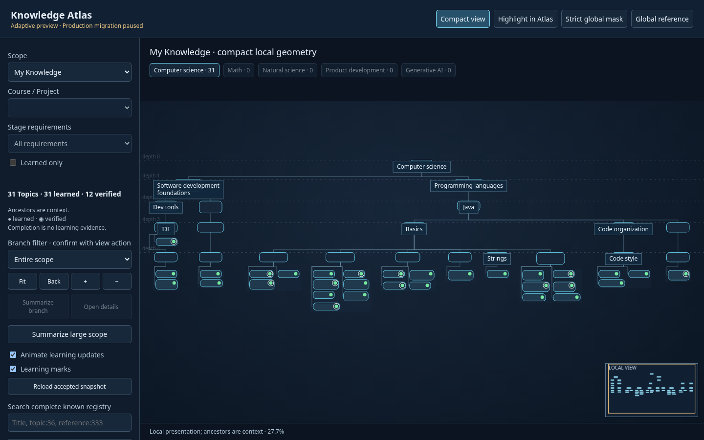
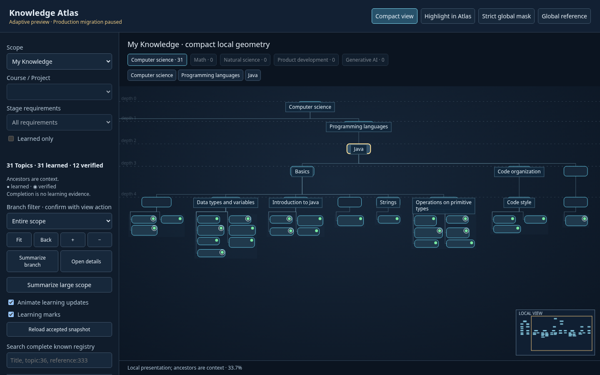
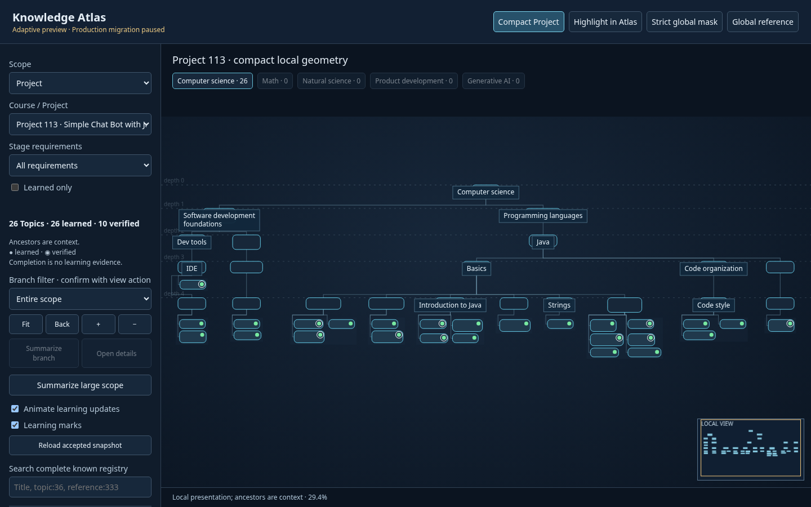

# Depth-constrained adaptive layout — 2026-10-06

**C — ADAPTIVE LAYOUT READY FOR PRODUCTION MIGRATION PREVIEW**

The local compact layout now uses exact taxonomy ranks and disjoint sibling subtree
boxes. The 1440×900 browser comparison reads top-to-bottom with visibly aligned
Category cards. Topic groups remain readable through group focus. Production
migration preview execution remains **PAUSED pending acceptance of this layout**.
No migration, commit, push or deployment was performed.

## Algorithm and depth bands

`scripts/knowledge_atlas/presentation/adaptive.cjs` now uses
`depth-banded-rectangular-contour-tidy@1`. Scope selection, semantic identities,
measured cards and canonical row-major Topic-tray construction are reused unchanged.
The original prototype and its historical validation remain unchanged.

The previous non-layered Flextree algorithm assigned independent subtree Y values.
An explicit comparison of My Knowledge found same-depth Category spreads of 18 px
at depth 2 and 36 px at depths 3/4. Its contour interleaving also did not enforce
disjoint complete rectangular subtree envelopes. This demonstrated defect justifies
replacing the local placement stage with a small conservative tidy-tree variant;
there is no force layout, search optimizer or dependency change.

For each **visible Category depth**, compute maximum measured Category height and
maximum measured tray height. With deterministic gaps:

```text
trayY[d] = categoryY[d] + maxCategoryHeight[d] + 32
categoryY[d+1] = trayY[d] + maxTrayHeight[d] + 40
```

All Categories at depth d receive exactly `categoryY[d]`, including collapsed
Categories. No child Category inherits its parent's individual height or tray height.
Topic rows have their existing local measured row heights inside the owner's tray.
A taller tray can enlarge a shared inter-rank band; it cannot stagger peer Categories.
The common geometry translation adds the same 16-px top safety margin to every rank.

## Subtree bounds and connectors

Bottom-up, each subtree supplies a rectangular contour/envelope covering its measured
Category, measured card labels, Topic tray/cards, children, connector corridors and
16-px safety padding. Its width is the maximum of the Category, tray and combined
child-envelope widths, plus padding. Children are packed in canonical order with a
**36-px gap between their complete envelopes**. The parent is centered over their
combined region; a larger parent/tray widens the enclosing box rather than overlapping
a neighbor. Roots use the same rule and canonical root order.

This conservative rectangular contour prevents interleaving even at different
depths. It costs some space compared with free contour packing, but directly enforces
`rightBounds(A) + 36 <= leftBounds(B)`. There are no global coordinates in this packing.

Local orthogonal Category routes descend beside an owned tray, then distribute from
a shared corridor below the tray band to child centers. Topic routes use the existing
rails between/beside columns. Routes avoid unrelated cards. Global routes are unchanged.

`adaptive_runtime/app.js` adds faint local rank guides. Low-zoom Category callouts
align with the card rank, stay inside the owner's projected subtree box and are
suppressed if they would cover another card. Ordinary overview callouts show titles;
collapsed summaries retain counts. Focused measured cards retain Topic / learned /
verified counts. This also fixes a Stage 617 callout obscuring a Topic card.

Changed runtime sources: the two files above. Regeneration changes only preview
`adaptive.cjs`, `app.js` and `preview-manifest.json`. New tests/evidence are in
`layout-refinement-tests/` and this report. Catalog, progress semantics, persistence,
global geometry and historical review/migration packages were not changed.

## Invariant results and real scenes

All seven mandatory invariants **PASS** for the four real scenes, three scale fixtures,
three explicit learning additions, existing branch/multi-branch growth fixtures and
a focused collapse case:

- `SAME_DEPTH_SAME_RANK`: exact equality, no tolerance for Category Y.
- `PARENT_ABOVE_CHILD`: strict positive Y separation.
- `NO_SIBLING_SUBTREE_OVERLAP`: full envelopes plus required gap.
- `NO_CARD_OVERLAP`: measured Category/Topic rectangles.
- `ORDER_PRESERVED`: canonical Categories left-to-right; Topics canonical row-major.
- `TOPIC_TRAY_CONTAINMENT`: every Topic inside its owner tray and subtree.
- `GLOBAL_GEOMETRY_UNCHANGED`: original bytes and packaged reference hash identical.

Parent centering, child-region containment, route identity and orthogonal routes are
also checked. No card overlap, sibling subtree overlap or unrelated-card route
crossing was found. Browser callouts pass containment and card-obscuring assertions.
Repeated identical explicit inputs produce identical positions, routes and bounds.

Real browser rank Y values:

| Scope | Category depths / Y values | Maximum same-depth spread |
|---|---|---:|
| My Knowledge | 0–4: 16, 158, 318, 478, 698 | 0 px |
| Course 8 | 0–6: 16, 158, 318, 478, 784, 1262, 1404 | 0 px |
| Project 113 | 0–4: 16, 158, 318, 478, 698 | 0 px |
| Stage 617 | 0–4: 16, 158, 318, 478, 698 | 0 px |

Computer science is depth 0; Software development foundations and Programming
languages share depth 1; Java is depth 2; Basics, Code organization and Errorless
code share depth 3. These identities/depths are taken from the unchanged reference.
They retain their rank even where overview callouts are suppressed for lack of room.

## Measurements and growth

Actual Chromium/system-font measurements at 1440×900, device scale 1. Bounds include
subtree safety/corridor envelopes; fit scale uses visible cards, as in the existing
camera helper. Single-run times include card measurement and layout, not a benchmark
claim. Fixtures use existing structural slots and generic titles with no learned facts.

| Scope | Topics / cards | Subtree bounds W × H | Layout ms | Fit | Labels at fit |
|---|---:|---:|---:|---:|---:|
| My Knowledge | 31 / 52 | 4,137 × 1,152 | 3.0 | 27.69% | 10 |
| Course 8 | 89 / 135 | 11,257 × 1,858 | 1.7 | 9.86% | 5 |
| Project 113 | 26 / 47 | 3,913 × 1,084 | 0.6 | 29.36% | 11 |
| Stage 617 | 12 / 28 | 2,142 × 1,016 | 0.3 | 51.23% | 13 |
| Fixture 100 | 100 / 125 | 7,734 × 1,422 | 1.3 | 14.48% | 4 |
| Fixture 300 | 300 / 382 | 26,329 × 1,846 | 3.1 | 4.18% | 0 |
| Fixture 1,000 | 1,000 / 1,285 | 88,591 × 2,406 | 9.8 | 1.24% | 0 |

The 31-Topic map remains compact but is wider/taller than the former 3,657 × 956
card bounds; the new table includes safety envelopes. Group focus displays **10 full,
untruncated Topic titles** at 116.90%. Overview fit does not display full Topic titles.
Expanded 300/1,000-slot views are structural diagrams, requiring existing summary,
branch focus or search for readable work. Collision-safe labeling intentionally shows
no microscopic labels there. No new DOI behavior or mobile validation was added.

Three sequential, explicitly marked **in-memory** learning additions (actual file
state stays 31 learned / 12 verified):

| Addition | Existing cards | Average / max displacement | Max horizontal / vertical | Max Category vertical | Selected screen anchor |
|---|---:|---:|---:|---:|---:|
| Topic 1: 31 → 32 | 52 | 45 / 260 px | 260 / 0 px | 0 px | 0 px |
| Topic 1033: 32 → 33 | 54 | 0 / 0 px | 0 / 0 px | 0 px | 0 px |
| Topic 1038: 33 → 34 | 55 | 35.35 / 196.16 px | 184 / 68 px | 0 px | 0 px |

The last vertical movement is existing Topic-card row/column repacking; Category Y
does not move in these three additions. Subtrees expand horizontally, canonical order
remains fixed, and the existing camera anchor preservation still works.

Existing isolated growth fixtures additionally show:

| Growth | Average / max movement | Max Category vertical movement |
|---|---:|---:|
| One branch 1 → 3 slots | 82.92 / 99.5 px | 0 px |
| One branch 3 → 6 | 0 / 0 px | 0 px |
| One branch 6 → 12 | 138.26 / 403.77 px | 0 px |
| Multiple branches 4 → 8 | 44.61 / 508.5 px | 0 px |
| Multiple branches 8 → 16 | 188.09 / 241.03 px | 136 px |
| Multiple branches 16 → 26 | 383.60 / 798.90 px | 136 px |

The 136-px shifts are shared rank-band expansion when a tray maximum grows, not
unrelated per-subtree staggering or a taxonomy-depth change. Exact same-depth
alignment passes after every step. This layout promises consistent ranks/order,
not constant absolute local Y across changing band requirements or zero movement.

## Browser acceptance and focused checks

One browser viewport, **1440×900**. The same focused harness was rerun while correcting
its stale-snapshot comparison and the demonstrated callout issue; no other viewport
or test matrix was used. Final screenshots were visually inspected: Categories align
on the guides, hierarchy reads top-to-bottom, card/tray regions are separate, and
Topic titles are readable in group focus. Not every overview Category can have a
collision-free callout; breadcrumbs/search/group focus remain necessary.





[Readable Topic group](layout-refinement-tests/topic-group.png) ·
[Stage 617](layout-refinement-tests/stage617.png)

Focused tests only: seven Core scenes, eight existing growth states, one collapse
case; browser measured layouts/navigation/learning at the one viewport. Broad-phase
buckets avoid all-pairs collision matrices. No full regression, crash recovery,
migration approval tests or historical package execution.
[Core results](layout-refinement-tests/layout-results.json),
[browser results](layout-refinement-tests/browser-results.json),
[protected-file results](layout-refinement-tests/integrity-results.json).

The previous integration's exact *old-algorithm parity* assertion is historical and
is superseded for this intentional placement change by the new focused invariants.
The original prototype and its reports are preserved as the before comparison.

## Protected bytes and local preview

All 31 protected files and their inventories are unchanged: 14 Production, 4 State,
11 Knowledge and 2 canonical generated-reference files. Aggregate hashes are SHA256
of sorted compact JSON mapping repository-relative paths to individual SHA256 values;
the linked integrity result contains those individual hashes.

| Area | Unchanged SHA256 |
|---|---|
| `docs/knowledge-map/` | `0b1b1f413c13f36689119c7b7115ae4bd963ff67352edfabcc72600ae037ee00` |
| `state/knowledge-atlas/` | `7b69371cb87d3dcb880803b9698b90bf09f322152ae8f1867424557a14b22137` |
| `data/knowledge/` | `29a3d477c5aed81e53c2bf551abcb6f41fbbf3b42d71e56a0bc7c813489d35f9` |
| Global geometry file | `bf79e7309129421b32899900a47f1c9f47d624f2fa16a4eb8b503f1be52aab25` |

Global reference routes/positions and Catalog entities are not mutated. Local
positions, bands and subtree bounds are separate derived Maps in memory. Regenerated
preview reference bytes match the protected original. Production remains unchanged.

From `/home/anton/IdeaProjects/hyperskill-projects`:

```sh
python -B scripts/update-knowledge-atlas.py --adaptive-preview --json
python -B -m http.server 8765 --bind 127.0.0.1 --directory .
```

URL: **http://127.0.0.1:8765/docs/knowledge-map-adaptive-preview/**

Focused reproducible checks:

```sh
node prototypes/adaptive-pyramid/layout-refinement-tests/layout.cjs
python -B prototypes/adaptive-pyramid/layout-refinement-tests/integrity.py
python -B scripts/update-knowledge-atlas.py --adaptive-preview --check --json
PLAYWRIGHT_MODULE=/home/anton/.cache/codex-runtimes/codex-primary-runtime/dependencies/node/node_modules/playwright CHROMIUM_EXECUTABLE=/home/anton/.cache/ms-playwright/chromium-1228/chrome-linux64/chrome node prototypes/adaptive-pyramid/layout-refinement-tests/browser.cjs
```
